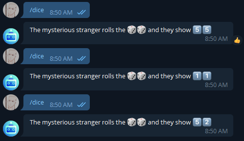

# FunnyBotTelegram
A simple telegram bot with cool and interesting features.

# Usage Examples
Call **/info** command to get list of available commands and any information that you add.

Call **/dice** command to get random number from 2 up 12 as emoji.

Call **/image** command to get random image by your request.

# Additional Information
This bot use [pyTelegramBotAPI](https://github.com/eternnoir/pyTelegramBotAPI)

To setup your bot and get api token You need to write to BotFather in telegram.

Also check [credits](Docs/Credits.txt)

## Wish You all the best!
